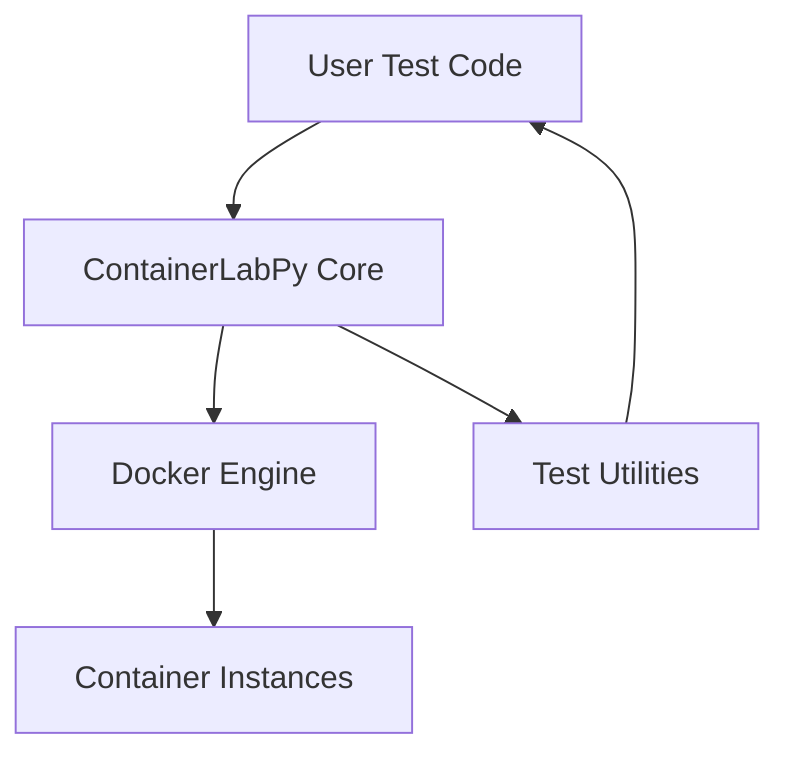
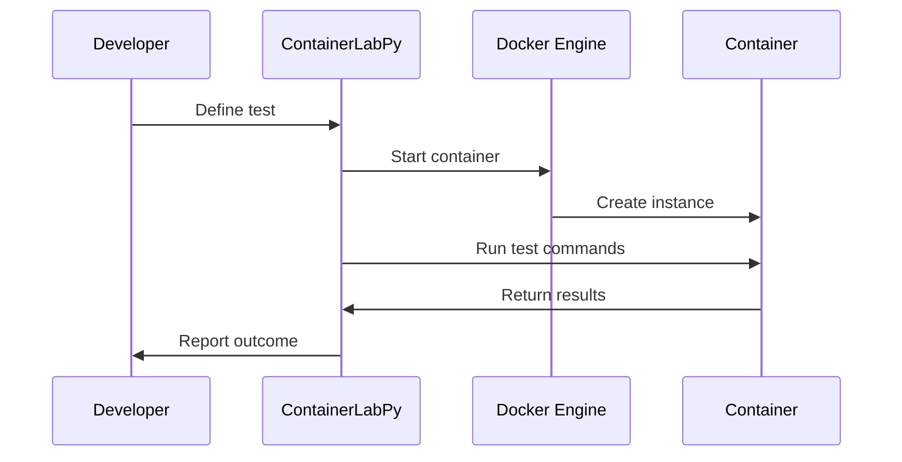

# ContainerLabPy

ContainerLabPy is a Python library designed to simplify the creation and management of containerized test environments. It enables developers to spin up isolated containers for integration testing, CI pipelines, and development workflows.

## Features

- Easy container orchestration for tests
- Docker integration
- Modular architecture
- Built-in test utilities
- Extensible for custom containers

## Project Structure

- `core/`: Main library code
- `tests/`: Test suite
- `docs/`: Documentation
- `scripts/`: Utility scripts

## Architecture

The following diagram illustrates the high-level architecture of ContainerLabPy:

### Architecture Diagram



## Testing Workflow

ContainerLabPy provides a robust testing workflow:

### Testing Diagram



## Getting Started

1. Install ContainerLabPy using pip:
   ```bash
   pip install containerlabpy
   ```
2. Write your first test:
   ```python
   from containerlabpy.core import Container
   container = Container(image="python:3.10")
   container.start()
   # Run your test logic
   container.stop()
   ```

## License

ContainerLabPy is licensed under the MIT License.
